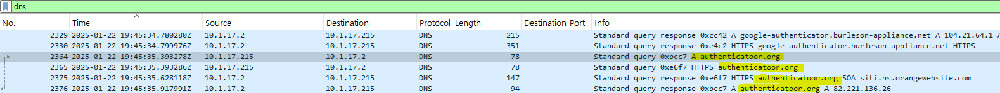
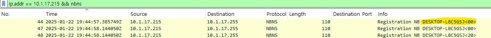
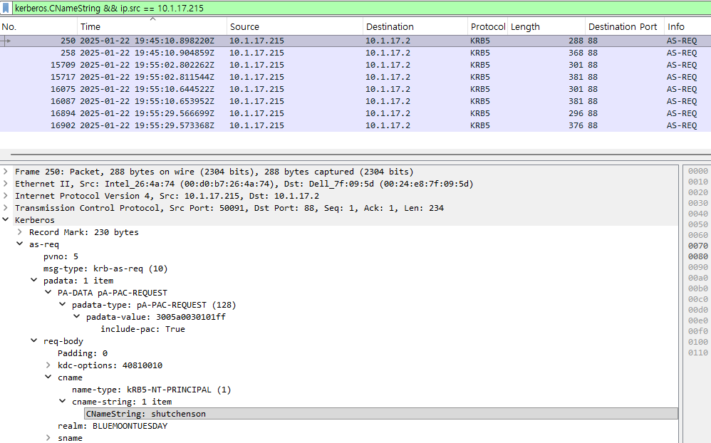
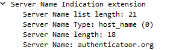

# Initial Investigation

## Objective

Investigate a reported Google Authenticator-related download and identify the potentially affected endpoint.

---

## Investigation Approach

The user reported downloading a file related to Google Authenticator from the web.

Based on this information, I started the investigation by reviewing DNS traffic in the PCAP to identify suspicious websites accessed by internal hosts.

Once a suspicious domain was identified, I used the associated internal IP address as the pivot point for further investigation.

I then used additional network protocols and Wireshark filters to identify the hostname and username associated with the endpoint.

---

## 1. DNS Investigation

### Wireshark Filter

```text
dns
```

I reviewed the DNS requests and looked for domains that appeared suspicious or were related to the reported download.

One domain stood out:

```text
authenticatoor.org
```

The domain appeared suspicious because its name closely resembles the legitimate Google Authenticator service.

The DNS request was made by:

```text
10.1.17.215
```

The domain resolved to:

```text
82.221.136.26
```

## Evidence



## Finding

```text
10.1.17.215
      |
      | DNS Query
      v
authenticatoor.org
      |
      | DNS Response
      v
82.221.136.26
```

This provided the first strong lead for identifying the potentially affected endpoint.

---

# 2. Endpoint Identification

After identifying `10.1.17.215` as the internal host that accessed the suspicious domain, I pivoted the investigation to this endpoint.

## Hostname Identification

I used NBNS traffic to identify the hostname associated with the IP address.

## Wireshark Filter

```text
ip.addr == 10.1.17.215 && nbns
```

The hostname was identified as:

```text
DESKTOP-L8C5GSJ
```

## Evidence



---

# 3. User Identification

I then investigated authentication traffic from the identified endpoint to determine the user associated with the activity.

## Wireshark Filter

```text
kerberos.CNameString && ip.src == 10.1.17.215
```

The Kerberos traffic identified the username:

```text
shutchenson
```

## Evidence



---

# 4. HTTPS Investigation

I investigated the communication between the identified endpoint and the suspicious website infrastructure.

## Wireshark Filter

```text
ip.addr == 10.1.17.215 && ip.addr == 82.221.136.26
```

The endpoint established an HTTPS connection to:

```text
82.221.136.26:443
```

The TLS Client Hello showed the Server Name Indication (SNI):

```text
authenticatoor.org
```

## Evidence



## Finding

The TLS SNI provided additional evidence linking the affected endpoint to the suspicious `authenticatoor.org` infrastructure.

The user had already reported that a file was downloaded, so the investigation did not attempt to recover the encrypted download contents.

---

# Initial Investigation Findings

| Indicator | Finding |
|---|---|
| Suspicious Domain | `authenticatoor.org` |
| Resolved IP | `82.221.136.26` |
| Affected Host IP | `10.1.17.215` |
| Hostname | `DESKTOP-L8C5GSJ` |
| Username | `shutchenson` |

---

# Analyst Assessment

The investigation began with the user's report of a Google Authenticator-related download.

Rather than starting with a known compromised IP address, I first reviewed DNS traffic to identify suspicious domains associated with the reported activity.

The domain `authenticatoor.org` was identified as suspicious and was queried by internal host `10.1.17.215`.

I then pivoted to this internal IP address and used NBNS and Kerberos traffic to identify the associated hostname and username.

The endpoint was subsequently observed communicating with the suspicious website over HTTPS, with `authenticatoor.org` visible as the TLS SNI.

At this stage, `10.1.17.215` was treated as the primary endpoint for further investigation.

The next phase of the investigation was to analyse the endpoint's external communications and identify potential command-and-control (C2) activity.
