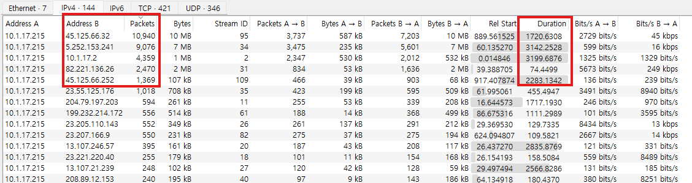
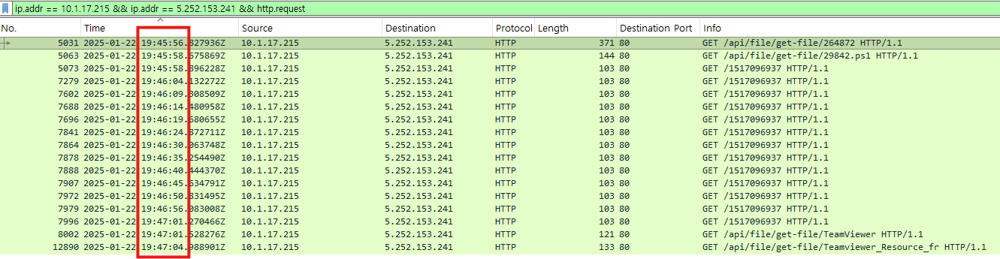
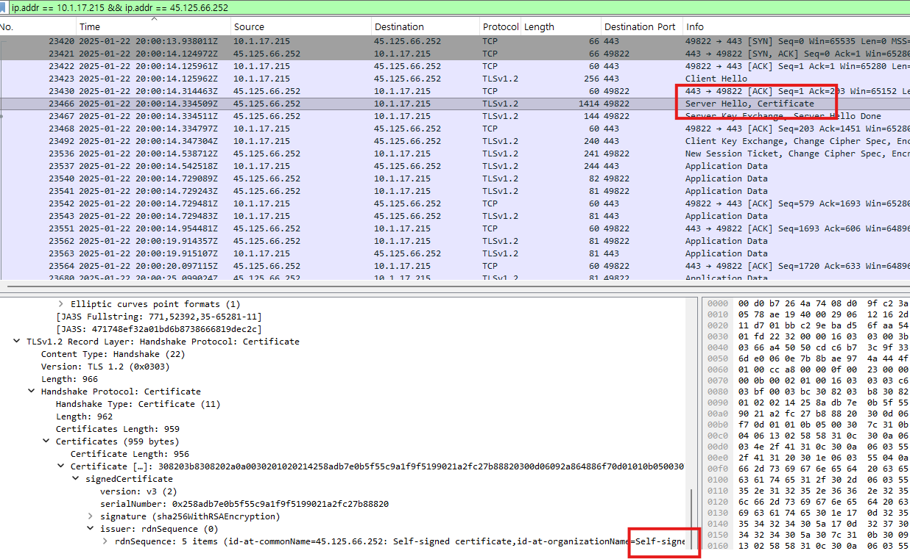

# C2 Investigation

## Objective

Investigate the external network communications from the identified endpoint `10.1.17.215` to determine whether the system was communicating with command-and-control (C2) infrastructure.

The investigation focused on:

- Repeated or automated communication patterns
- Destination IP addresses
- Destination ports
- Protocols
- HTTP requests
- TLS connections
- TLS certificates
- Communication frequency and duration

---

# 1. Identifying Suspicious External Connections

After identifying `10.1.17.215` as the affected endpoint, I reviewed its external communications to identify unusual or potentially malicious destinations.

## Identifying High-Volume External Connections

I reviewed the Conversations view in Wireshark to identify which external destination IP addresses were communicating with the affected host most frequently.

I sorted the conversations by the number of packets exchanged to prioritize the destinations with the highest volume of communication.

This helped narrow down the external connections that required further investigation.

### Evidence



### Observation

The affected host `10.1.17.215` had several high-volume external connections.

The below destinations that stood out during the review were:

- `45.125.66.252` — 10,940 packets
- `5.252.153.241` — 9,076 packets
- `82.221.136.26` — 2,470 packets
- `45.125.66.252` — 1,369 packets

I prioritized these connections for further investigation based on their traffic volume and other network indicators.

### Finding

Packet volume alone does not confirm malicious activity. However, it provided a useful way to prioritize the external connections for deeper analysis.

I therefore investigated the three highest-priority destinations further by reviewing their protocols, ports, communication patterns, and TLS information.


---

# 2. C2 IP — 5.252.153.241

The first significant connection identified was between the affected endpoint and:

```text
5.252.153.241
```

The connection generated a large amount of traffic and continued for an extended period.

Approximately 9,000 packets and 7 MB of traffic were observed during the communication.

## Wireshark Filter

```text
ip.addr == 10.1.17.215 && ip.addr == 5.252.153.241
```

### Observation

The endpoint maintained repeated communication with `5.252.153.241` every 5 seconds.

The traffic contained HTTP requests.

To investigate the HTTP activity further, I filtered for HTTP requests between the endpoint and the destination.

## Wireshark Filter

```text
ip.addr == 10.1.17.215 && ip.addr == 5.252.153.241 && http.request
```

### Evidence



The traffic contained requests such as:

```text
GET /1517096937 HTTP/1.1
Host: 5.252.153.241
```

The server frequently responded with:

```text
404 Not Found
```

### Communication Pattern

The requests appeared at regular intervals of approximately 5 seconds.

This regular timing is unusual for normal web browsing and is consistent with automated beaconing behaviour.

### Finding

The combination of:

- Repeated HTTP requests
- Regular approximately 5-second intervals
- Long-running communication
- Large number of packets
- Communication with a direct IP address rather than a normal website hostname

provided strong evidence of automated C2 communication.

Therefore:

```text
5.252.153.241
```

was identified as C2 infrastructure.

---

# 3. C2 IP — 45.125.66.32

A second suspicious destination identified from the affected endpoint was:

```text
45.125.66.32
```

The connection used TCP port:

```text
2917
```

Port `2917` is not a typical HTTPS port.

## Wireshark Filter

```text
ip.addr == 10.1.17.215 && ip.addr == 45.125.66.32
```

### Observation

The endpoint established an encrypted TLS connection with `45.125.66.32` over TCP port `2917`.

The use of TLS encryption prevented inspection of the application-layer contents.

I therefore investigated the TLS certificate presented by the remote server.

## Wireshark Filter

```text
ip.addr == 10.1.17.215 && ip.addr == 45.125.66.32 && tls
```

### Evidence


The certificate identified the server as:

```text
45.125.66.32
```

The certificate was self-signed.

### Finding

The following indicators made this connection suspicious:

- Communication with a previously identified affected endpoint
- TLS-encrypted communication
- Non-standard TCP port `2917`
- Self-signed TLS certificate

Based on these indicators and the investigation context, the destination was identified as C2 infrastructure:

```text
45.125.66.32
```

---

# 4. C2 IP — 45.125.66.252

A third suspicious destination identified from the affected endpoint was:

```text
45.125.66.252
```

The communication used the standard HTTPS port:

```text
443
```

Approximately 1,300 packets were observed between the affected endpoint and this destination.

## Wireshark Filter

```text
ip.addr == 10.1.17.215 && ip.addr == 45.125.66.252
```

### Observation

The endpoint communicated with `45.125.66.252` over TCP/443.

Unlike the previous C2 connection, port `443` is commonly used for legitimate HTTPS traffic, so the port alone was not considered suspicious.

I therefore investigated the TLS session and certificate.

## Wireshark Filter

```text
ip.addr == 10.1.17.215 && ip.addr == 45.125.66.252 && tls
```

### Evidence



The server presented a self-signed certificate.

### Finding

The combination of:

- Communication from the identified affected endpoint
- Sustained network traffic
- TLS-encrypted communication
- Self-signed certificate

provided additional evidence that this connection was associated with C2 activity.

Therefore:

```text
45.125.66.252
```

was identified as C2 infrastructure.

---

# 5. C2 Investigation Summary

The investigation identified three external IP addresses associated with C2 communication from the affected endpoint.

| C2 IP | Protocol | Port | Key Evidence |
|---|---|---:|---|
| `5.252.153.241` | HTTP | 80 | Repeated requests approximately every 5 seconds |
| `45.125.66.32` | TLS | 2917 | Non-standard port and self-signed certificate |
| `45.125.66.252` | TLS | 443 | Sustained traffic and self-signed certificate |

---

# C2 Communication Overview

```text
                    Affected Endpoint
                     10.1.17.215
                          |
          +---------------+---------------+
          |               |               |
          v               v               v
  5.252.153.241     45.125.66.32    45.125.66.252
       HTTP             TLS              TLS
       Port 80          Port 2917        Port 443
          |               |               |
          |               |               |
     Regular         Self-signed      Self-signed
     beaconing        certificate      certificate
     ~5 seconds
```

---

# Analyst Assessment

The external traffic analysis identified three destinations associated with suspicious communication from the affected endpoint `10.1.17.215`.

The strongest evidence was observed with `5.252.153.241`, where the endpoint repeatedly sent HTTP requests at approximately five-second intervals. This regular communication pattern is consistent with automated beaconing.

The connection to `45.125.66.32` was also suspicious due to the use of a non-standard TCP port `2917` and a self-signed TLS certificate.

The connection to `45.125.66.252` used the standard HTTPS port `443`, which by itself is not suspicious. However, the sustained communication and self-signed TLS certificate provided additional indicators when considered together with the other evidence.

Based on the combined network evidence, the following IP addresses were identified as C2 infrastructure:

```text
5.252.153.241
45.125.66.32
45.125.66.252
```

The next step is to document the complete investigation timeline, Indicators of Compromise (IOCs), and recommended SOC response actions.
